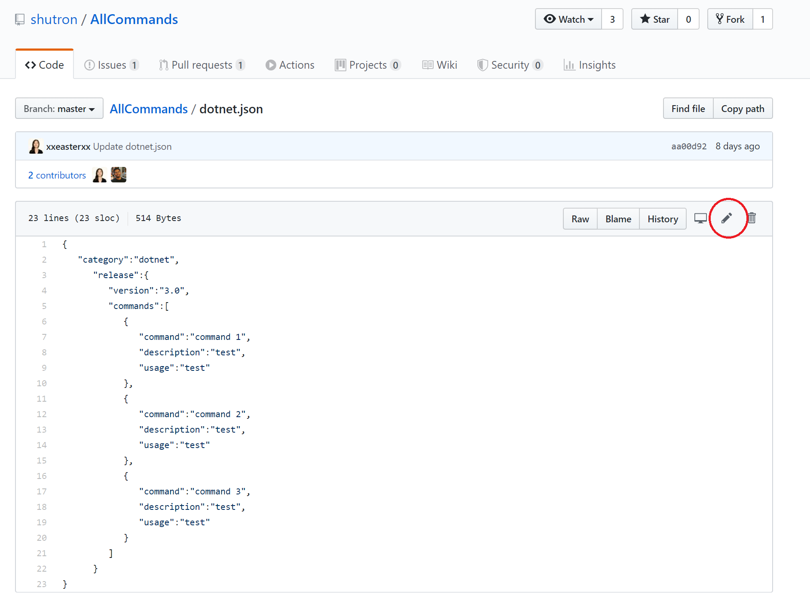
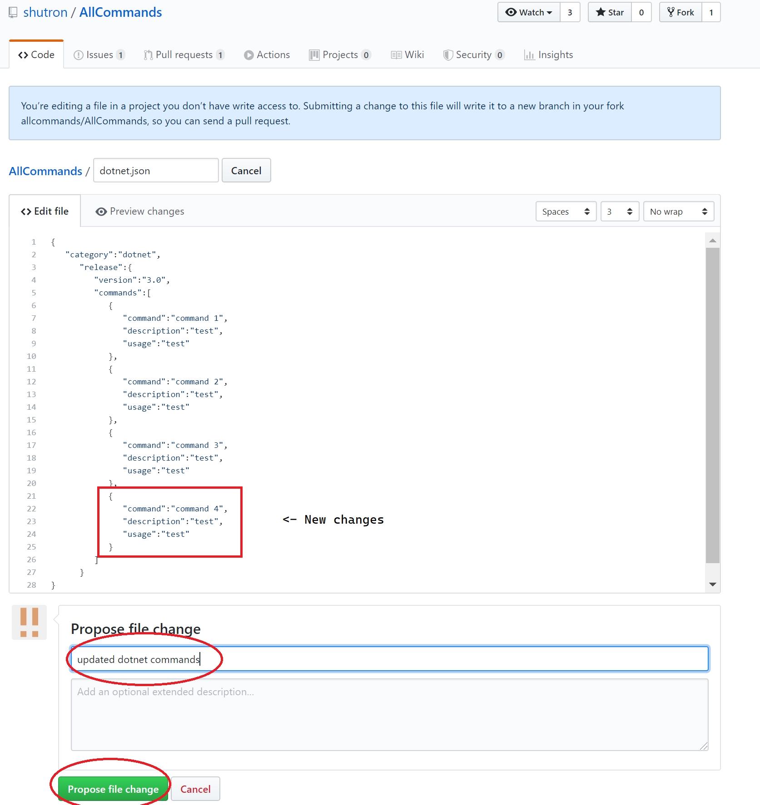
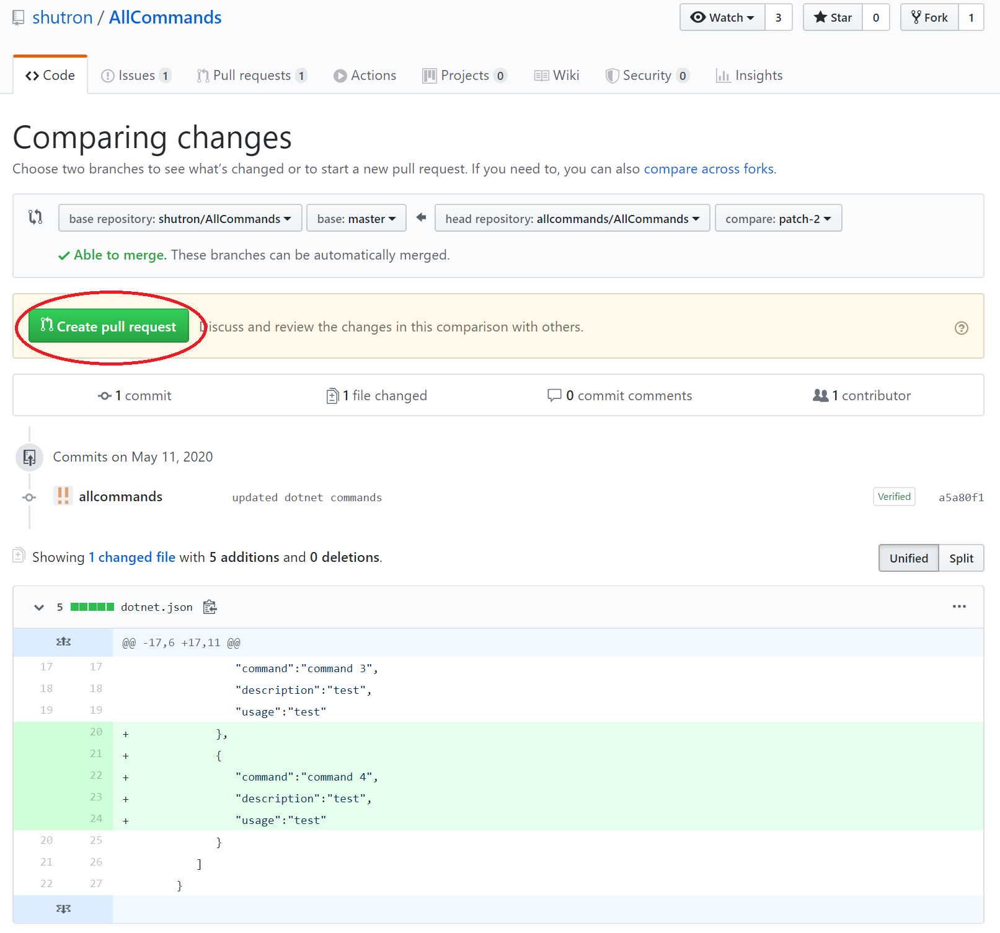
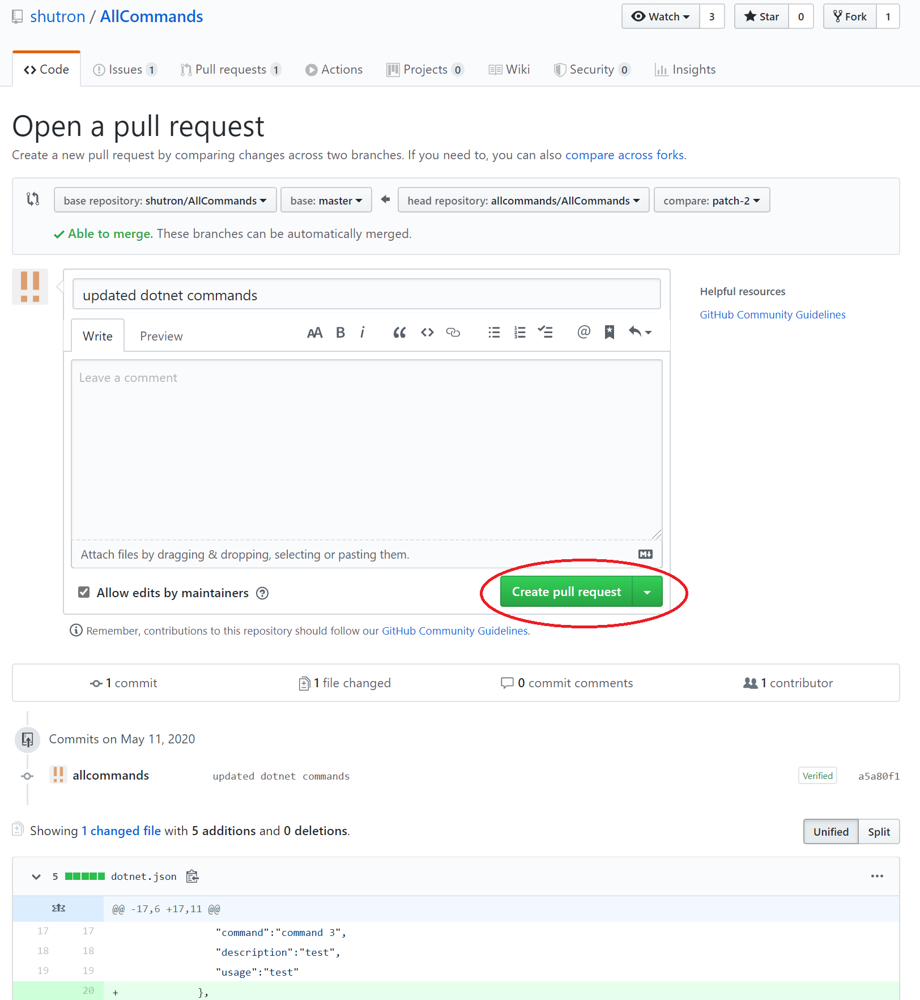
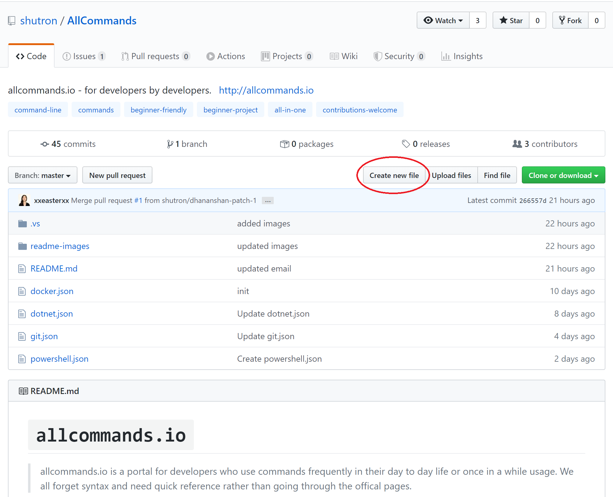
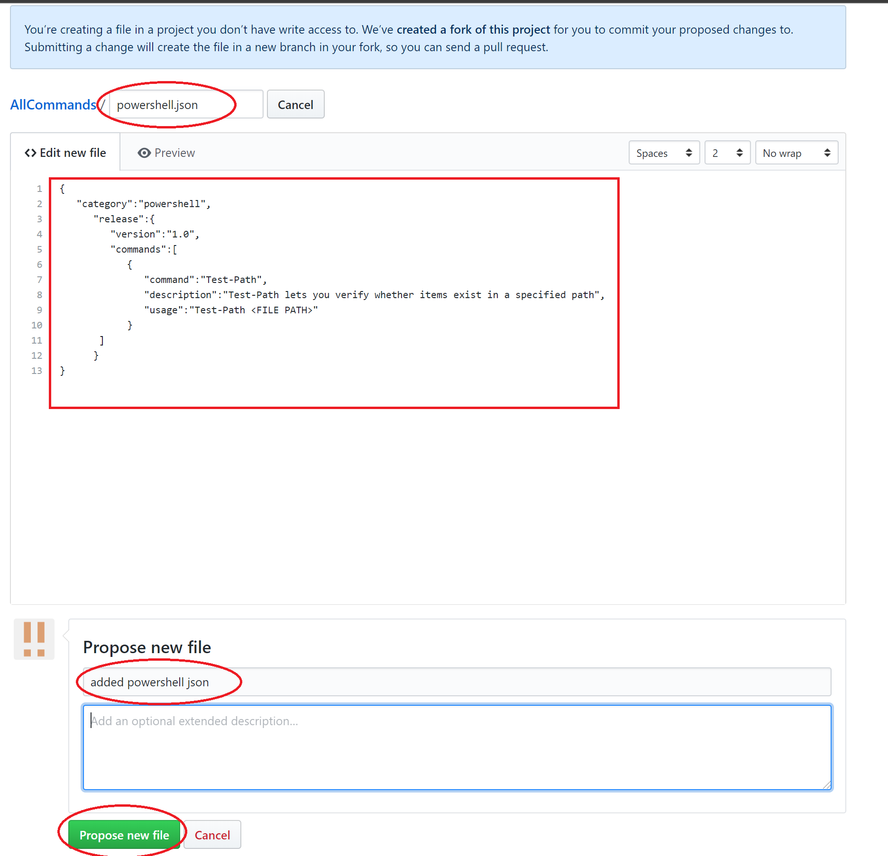
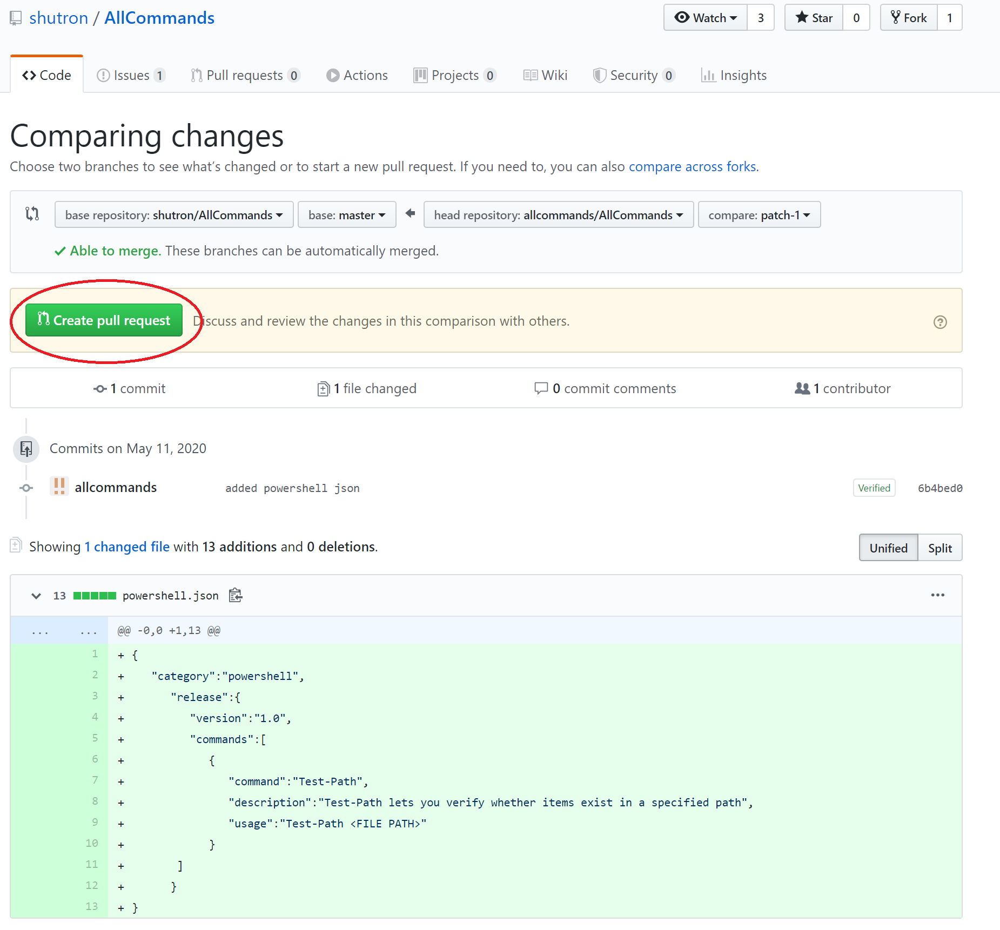
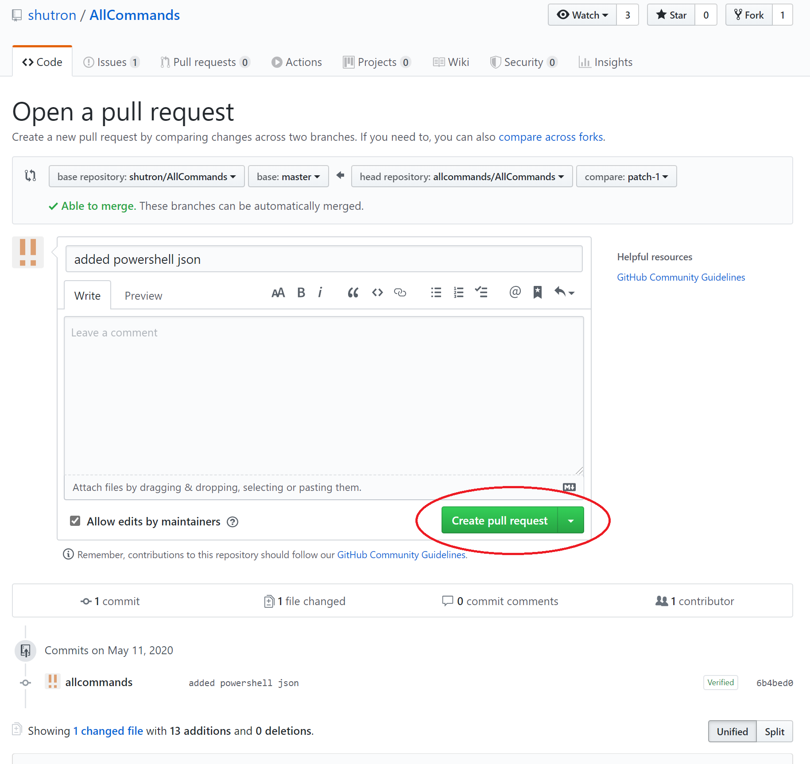

## Contributors ✨
Thanks goes to these wonderful people, we will upload your picture once you make your contribution

<!-- prettier-ignore-start -->
<!-- markdownlint-disable -->
<table>
  <tr>
    <td align="center"><a href="https://github.com/xxeasterxx"><br /><sub><b>Esther</b></sub></a><br /></td>

 <td align="center"><a href="https://github.com/m3yevn"><br /><sub><b>Kevin</b></sub></a><br /></td>
 
  <td align="center"><a href="https://github.com/tlnithin"><br /><sub><b>Nithin</b></sub></a><br /></td>
  
   <td align="center"><a href="https://github.com/xiaoai0109"><br /><sub><b>Peiyan</b></sub></a><br /></td>
   
   <td align="center"><a href="https://github.com/dhananshan"><br /><sub><b>Dhananshan</b></sub></a><br /></td>
    
  </tr>
</table>
<!-- markdownlint-enable -->
<!-- prettier-ignore-end -->
<!-- ALL-CONTRIBUTORS-LIST:END -->

# `allcommands.io`
> [allcommands.io](http://allcommands.io) is a portal for developers who use commands frequently in their day to day life or once in a while usage. We all forget syntax and need quick reference rather than going through the offical pages.  

  - This repo contains json file for each framework, tool, etc. which requires contribution
  - The repo for [allcommands.io](http://allcommands.io) portal is [here](https://github.com/shutron/AllCommands.Portal). Feel free to contribute there as well 

# Setup
> This repo contains `.json` files for each framework/ tool (e.g. dotnet.json, docker.json, etc). Each of these `.json` files contains respective commands added by valuable contributer like you. There is another repo for the web application allcommands.io which is [here](https://github.com/shutron/AllCommands.Portal). The web app will read each of these `.json` files and display. Its simple as it is.  

# How To Contribute
> Its extremely simple to contribute. The follwing 3 steps is all needed to contribute. Each steps are explained with pictures.

- If you are already familiar with git then you know the drill. 
 -> `fork` 
 -> `create a new branch from master`
 -> `add/ edit your changes`
 -> `push the branch`
 -> `create a pull request`

- For those who are new, follow the below 2 option to contribute directly via github portal. 

### Option1: If you want to add commands to an existing file

1.  Go to allcommands [repositary](https://github.com/shutron/AllCommands)
2.  Click on the file you want to edit (e.g. dotnet.json)
3.  Click on `edit` icon



4.  Make your changes then add your comment and click on `Propose file change`



5.  Then click on `Create pull request` button



6.  Now you will be in `Open a pull request page`, leave any comments if necessary and click on `Create pull request`



### Option2: If you want to add commands to a framework/ tool which does not have an existing file 

1.  Go to allcommands [repositary](https://github.com/shutron/AllCommands)
2.  Click on `Create new file`



3.  Add a filename (e.g. powershell.json), add your commands, comment and click on `Propose new file`



4.  Then click on `Create pull request` button



5.  Now you will be in `Open a pull request page`, leave any comments if necessary and click on `Create pull request`



That's all needed to contribute. One of the reviewers will merge it into the master and the commands will be visible in allcommands.io portal which will be used by many developers.


# JSON format

```json
{
   "category":"powershell",
      "release":{
         "version":"1.0",
         "commands":[
            {
               "command":"Test-Path",
               "description":"Test-Path lets you verify whether items exist in a specified path",
               "usage":"Test-Path <FILE PATH>"
            },
            {
               "command":"Start-Sleep",
               "description":"To suspend the activity in a script or session",
               "usage":"Start-Sleep -Seconds <Seconds>",
               "options":[
                  {
                     "value":"Seconds",
                     "description":"sleep in seconds",
                     "usage":"Start-Sleep -Seconds <Seconds>"
                  },
                  {
                     "value":"Milliseconds ",
                     "description":"sleep in milliseconds",
                     "usage":"Start-Sleep -Milliseconds <Milliseconds>"
                  }
               ]
            }   
       ]
      }
}
```
### JSON format Explained

Key  | Description
------------- | -------------
category  | The framework or tool (should be same as file name excl .json) 
release  |  
version  | Version number of document (retain it when updating or default to 1.0 when adding new) 
commands  | 
command  | Command name eg. git pull
description  | Describe what the command does
usage  | Example of the command usage 
options  | Array of options that come with the commands 
value  | The value of option eg. git pull origin master. Just have to put origin [branch name] 
description | Describe what the option does
usage  | Example of the command with option 


### TODO
- [ ] Login feature
- [ ] bookmark frequently used commands

### Feedback
allcommands.io is for developers by developers. Please feel free to raise issue in github or feel free to contact us via admin@allcommands.io
